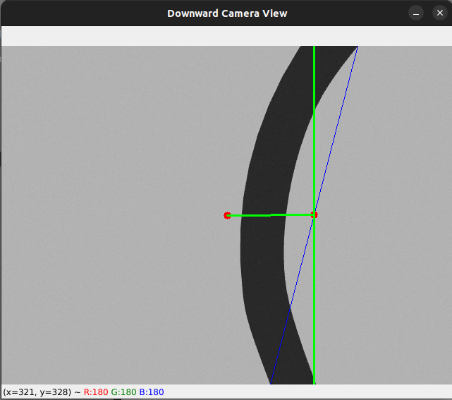

# 🛸 Line-Following Drone in Gazebo using ROS 2 + PX4

A ROS 2-based drone simulation project where a drone uses visual feedback from a downward-facing camera to follow a black line in a Gazebo environment.

> Built with: **ROS 2 (Humble)**, **PX4 Autopilot**, **Gazebo Classic**, and custom Python controllers.

---
### 🔍 Problem Statement

Once PX4 and Gazebo are launched, we subscribe to the drone's **downward camera feed** and compute the orientation and position of the black line in the image. Based on this, the drone adjusts its **yaw and forward velocity** to stay aligned with the path.

---

## 📺 Demo Video

Watch the drone in action:  

[](https://www.youtube.com/watch?v=aIVb1TgZmYs)

---

# 🧠 How It Works: Line Following Drone Logic
### 🖼️ Visual Debug (Camera View)

Here's a sample debug view from the downward camera with the following overlays:
🟥 **Red dots** mark the image center and midpoint of the detected line, those should be align to make the drone move on the line
🟦 **Blue line** is the detected path vector
🟩 **Green line** shows offset and orientation correction reference

- The line connecting the two red dots acts as a string and pulls the path vector to center
- green line is the reference for the blue line, it should align with it then drone will align with the line on the ground



---

### 🧮 Code Logic Explained

We process the camera feed and apply the following:

#### 1. **Image Preprocessing**
- Convert to grayscale
- Apply threshold to isolate black lines (`cv2.THRESH_BINARY_INV`)

#### 2. **Line Detection**
- Extract contours and find the line vector from the bottom part of the image
- Compute midpoint of the line and the angle it makes

#### 3. **Control Strategy**
We apply **two PID controllers**:
- **Yaw PID:** Align drone heading to match line orientation
- **Offset PID:** Correct lateral offset from image center

Final yaw command:
```python
self.yaw += -pid_angle + pid_offset
```

#### 4. **Publishing Commands**

Commands are sent via `geometry_msgs/msg/Vector3`, where:

* `x` is forward velocity (fixed)
* `y` is yaw velocity (computed)
* `z` is unused

#### 5. **Commanding the drone**
controler.py node will receive the `desired_yaw` and `speed`, convert them to drone command velocities as below and send the command

```python
self.vx = self.speed * math.cos(self.desired_yaw)
self.vy = self.speed * math.sin(self.desired_yaw)
```


---

### 📦 Architecture

```text
PX4 + Gazebo
    ↓
Downward Camera Feed (/compressed)
    ↓
Image Processing (OpenCV)
    ↓
Line Vector Extraction + PID Control
    ↓
Velocity Commands (/velocity_vector)
```

---

# 🚀 Making the drone to move

## 🔧 Prerequisites

Before running this package, ensure you have the following installed:

1. **ROS 2 Humble**  
2. **PX4 Autopilot (v1.13 or later)**  
3. **Gazebo Classic (11)**  
4. **MAVROS & microRTPS agent**  
5. **PX4 SITL environment setup**

> 📘 Follow [PX4 + ROS 2 + Gazebo-classic Setup Guide](https://docs.px4.io/main/en/ros/ros2_comm.html) if not already set up.


---

## 📦 Installation Steps

```bash
# Clone the repo
mkdir ~/px4_ros2_ws/src
cd ~/px4_ros2_ws/src
git clone https://github.com/your-username/line_follower_drone.git

# Go back to workspace root
cd ~/px4_ros2_ws

# Install dependencies if needed
rosdep install --from-paths src --ignore-src -r -y

# Build
colcon build

# Source setup
source install/setup.bash
```

---

## ▶️ Launch Instructions
before launcing change some files with the files provided in the assets folder, some more info is give below, maybe in future i will write script to automate the process, for now do copy and edit them manually

```bash
# In a new terminal
cd ~/px4_ros2_ws
source install/setup.bash
ros2 launch line_follower_drone line_follower_launch.py
```
---

## 📂 Provided Resources

This repo includes the following files inside the `assets/` folder:

| File              | Description                                 |
|-------------------|---------------------------------------------|
| `track1_s80.dae`  | Track mesh for the drone to follow          |
| `empty.world`     | Gazebo world that includes the track model  |
| `iris.sdf.jinja`  | Editable PX4-compatible drone model         |

---

## 🛠️ Customization

* 🛣️ **New Tracks**: You can generate new `.dae` meshes and replace `track1_s80.dae`, this track is used in world file, modify the track file path in the world file
* 🌍 **World Setup**: Use `empty.world` as a base for your custom simulation environments, keep a copy of the default `empty.world` file
* 🛩️ **Custom Drone**: Replace the default Iris model with `iris.sdf.jinja` keep a copy of the original file

---

## 📚 Resources to learn more

* [PX4 Autopilot](https://docs.px4.io/main/en/sim_gazebo_classic/)
* [ROS 2](https://docs.ros.org/en/humble/index.html)
* [Gazebo Simulator](https://gazebosim.org/docs/all/getstarted/)
* [Building a robot by Articulated Robotics](https://www.youtube.com/playlist?list=PLunhqkrRNRhYAffV8JDiFOatQXuU-NnxT)
---

## 💬 Contact

Maintained by **Kottapeta Sai**
📧 [Email](mailto:sai@example.com)
🌐 [Portfolio](https://sipayi.github.io)

---
